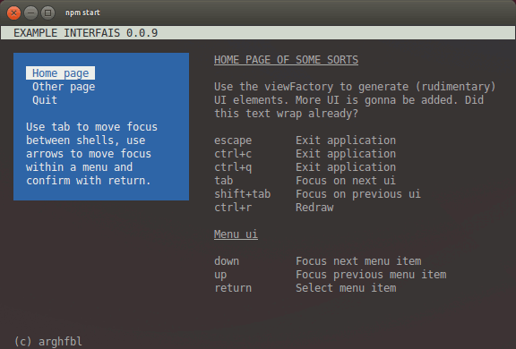

# INTERFAIS



__What it do?__ It provides you with an API to generate a terminal app with different views in different cells, different "routes" to get to a combination of those views and different UI elements to populate those views with.

__How it does?__ It gives you an appFactory, viewFactory and some helper functions to make it easy for you to generate UI with the results of your own application's logic. Check out the `./example` directory, or run `npm start` for a working examle application.

# Views and the UI
The application takes Views and renders them in a configured arrangement, a View is basically just a bunch of callbacks that dictate what happens when a view is loaded, closed, focused, etc. This is also where the UI gets constructed.

The UI is defined using the uiFactory, and goes consists of a bunch of (chainable) functions that queues your content for render-time. These UI functions give you basic formatting, styles and interactivity for stuff like headers, paragraphs, menu options etc, taking position, size, padding and margin of a cell into account.

To create your own view:

```
function(ui, viewParameters) {
    var lastBurger = new Date().getTime();
    ui
        .background('blue')
        
        .foreground('white')
        
        // Two rows and one column offset between cell edge and UI bg
        .margin(2, 1)
        
        // One row and two columns offset between UI bg and ASCII content/foreground
        .padding(1, 2)
        
        // Uppercased and underlined
        .h1('Page header, its pretty prominent')
        
        // Wrapping text
        .paragraph('Paragraph text, or a bunch of paragraphs. Text in this style wraps to the edges of the cell nicely. The following line renders a ruler of dash characters:')
        
        // Unordered list
        .list([
            'List items wrap as well...',
            '...and are preceded by a list bullet'
        ])
        
        // Simple table of key/value pairs
        .keyValue({
            'Method': 'ui.keyValue()',
            'Purpose': 'To present key/value pairs, kind of like a definition list',
            'Arguments': 'An object, or an array of objects describing the key and value'
        })        
        
        // Character repeat across view width
        .ruler('-')
        
        // Non-wrapping line
        .line('A line does not wrap')
        
        // Empty line
        .spacer()
        
        // Underlined
        .h2('Moar advanced')
        
        // Listen to certain lifecycle events
        .on('focus', function() {
            // Other events are:
            // blur, open, close, render, interval
            // menu:shift, menu:confirm
        })
        
        // Adds one selectable menu item
        .option('Hit [ENTER] to select me', function() {
            // Run when option item is selected
            
            // Example:
            interfais.routeManager.openRoute('regular-page', {
            	randomViewParameter: Math.floor(Math.random() * 1337)
            });
        })

        // Adds an input field (password-ish) that executes callback on [return]
        .input('Secret password: ', function(givenPassword) {
            if(givenPassword === 'interfais') {
            	interfais.routeManager.openRoute('secure-page');
            }
        }, { hidden: true})

        // Force view rerender every x milliseconds
        .interval(1000)
        
        // UI with dynamic content
        .line(function() {
            // Rerun at each render, so always up to date, great place to do a lookup
            // in one of your services
            
            // Always returns an *array* of arguments which would be passed to the
            // actual method, line() in this case. Example:
            var secondsSinceBurger = (new Date().getTime() - lastBurger)/1000;
            return ['I ate my last burger ' + secondsSinceBurger + ' seconds ago'];
        });
};
```

# Install

```
# Clone and run example:
git clone git@github.com:wvbe/interfais.git
cd interfais
npm install
npm start

# Use in project
npm install git+https://git@github.com/wvbe/interfais.git#master --save
# or
npm install git+https://git@github.com/wvbe/interfais.git#develop --save
```

# Other notes
If you'd like to use this project and require versioned dependencies, point to a specific tag, commit, send me a message (and I'll version) or create a fork. Pull requests are, of course, encouraged!

* v 1.0.0
    * Managers & applicable factories instanced within, and exposed through interfais application instance, this change introduces breaking changes.
    * ui.stream() for streaming stdout and stderr from spawned child processes, for example
    * ui.keyValue() for formatting key/value pairs
    * ui.clear() instead of cell.clear() for instantly clearing available ui space
    * Dropping app.init() method, dropping route config to constructor
    * Tried it on a mac, it was OK
    * Configurable key combo's for interactions
    * InputManager.catch can alternatively emit named events, which is actually preferred for functionality tucked away in an aspect
    * Code cleanup everywhere, docs for the most important parts
* v 0.1.1
    * scrolling with shift+up and shift+down
    * ui.input() configurator for text or input fields
    * ui.paragraph() takes formatting as second argument
    * ui.line() now also takes string arrays as first argument
    * ui emits events for lifecycle and interactivity events
    * Use a 404 view if provided and applicable
    * Fixed a rather serious bug that caused loads of rerenders
    * Reusing FocusManager for ui interactivity as well
* v 0.1.0
    * Initial release

# Bucket list
* Windows compati... never mind
* Better way to ui.clear(), or rerender select rows in general.
* Color themes/palettes for different cases (eg. focused, blurred, highlighted, dimmed, error, warn, info, etc...)
* Fix the bugs listed under "Known bugs"
* Not prerender lines before viewport & scroll, instead remember last queueItem & queueItemLine
* Not preprender lines after viewport & scroll
* Exit early when cannot scroll, (or at least not clear lines further than one (or scrollDistance) rows away from lines when scrolling up or down)
* pageUp & pageDown should first/last focus ui menu
* A catch() mechanism in InputManager that keeps an array of catches, but only uses the most recent one an pops when released.

# Compatibility
Works on my machine (ubuntu box). Seen it work on an apple. Doesn't work on windows, though it didn't break as hard as I had expected it to. Pull requests are welcome, since I have no intention of adopting Windows as a development platform myself.

# Known bugs
* If you're feeling brave, run a text search in lib/ for "@TODO"
* Lists and keyValue pairs lose their special formatting after focus or blur, because there is no proper color palette thingy theme.
* The system runs into an infinite loop or division by zero somewhere when the UI is too narrow to leave room for stretching cells one fixed-width cells take up all the space. For this reason, the minimum layout width is hardcoded to 60 columns.
* Input fields may render partial formatting characters when they are almost as wide as the available width. The input value should be clipped, instead of the whole rendered line.
* The system is limited in that it cannot detect synchronous ui.render() calls in ui.render() line callbacks. This would cause an infinite loop and out-of-memory crash.

# Licence
Copyright (c) 2014 Wybe Minnebo

Permission is hereby granted, free of charge, to any person obtaining a copy of this software and associated documentation files (the "Software"), to deal in the Software without restriction, including without limitation the rights to use, copy, modify, merge, publish, distribute, sublicense, and/or sell copies of the Software, and to permit persons to whom the Software is furnished to do so, subject to the following conditions:

The above copyright notice and this permission notice shall be included in all copies or substantial portions of the Software.

__THE SOFTWARE IS PROVIDED "AS IS", WITHOUT WARRANTY OF ANY KIND, EXPRESS OR IMPLIED, INCLUDING BUT NOT LIMITED TO THE WARRANTIES OF MERCHANTABILITY, FITNESS FOR A PARTICULAR PURPOSE AND NONINFRINGEMENT. IN NO EVENT SHALL THE AUTHORS OR COPYRIGHT HOLDERS BE LIABLE FOR ANY CLAIM, DAMAGES OR OTHER LIABILITY, WHETHER IN AN ACTION OF CONTRACT, TORT OR OTHERWISE, ARISING FROM, OUT OF OR IN CONNECTION WITH THE SOFTWARE OR THE USE OR OTHER DEALINGS IN THE SOFTWARE.__